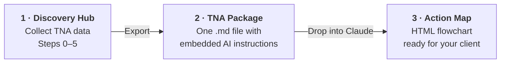

# Discovery Hub — TNA Data Collection Tool

🇻🇳 [Đọc bản tiếng Việt](README.vi.md)

**A Training Needs Analysis (TNA) data collection tool for Instructional Designers**, built on the Action Mapping method (Cathy Moore — *Map It*). A single HTML file that runs offline, requires no installation, and never sends your data anywhere.

**▶ Use it now:**  https://ngolinhtrang2011-dot.github.io/discovery-hub/*
**▶ Or download:** get `discovery-hub.html` → open with Chrome/Edge

---

## Why this tool exists

Doing TNA properly requires many types of data: goal alignment records, operational data, staff interviews, SME interviews, learner profiles... The traditional way is dozens of scattered files — filled in by hand, retyped, consolidated manually. Discovery Hub brings everything into one place under a single principle: **enter data once — it flows into every output.**

## Key features

- **Step 0 — Go/No-Go Screening:** 7 screening questions that confirm whether Action Mapping fits your project, with an automatic verdict (GO / GO WITH CONDITIONS / NO-GO) and alternative recommendations when it doesn't
- **Steps 1–5 — Structured collection:** Business Goal → Operational Data (with file uploads) → Staff Interviews → Learner Profile → SME Interviews & Scenario Bank
- **Interview recording + automatic transcription** (Chrome/Edge, internet required) — offline recording still works; paste transcripts later
- **TNA Package export:** a single `.md` file containing all collected data plus embedded AI instructions — drop it into Claude to generate a complete Action Map
- **Bilingual Vietnamese–English UI**, instant switching
- **Runs on smartphone, tablet, and desktop** — optimized for note-taking during live interviews
- **Autosave** + JSON Export/Import for backups and merging data from multiple collectors

## Get started in 3 minutes

1. Open the link (or file) in **Chrome/Edge**
2. Complete **Step 0** — if the verdict is NO-GO, stop and read the recommendations (seriously!)
3. Work through Steps 1 → 5; the app autosaves as you go
4. **Export JSON** to back up (do this often — see the warning below)
5. When your data is complete → **Export TNA Package** → drop the file into Claude/Cowork → receive an Action Map flowchart

**No data yet?** Download `demo-data.json` from this repo → Import it into the app to explore a complete sample project.

## The full AI workflow

| Stage | What you do | What you get |
|---|---|---|
| **1 · Discovery Hub** | Work through Steps 0–5, entering data as you go | All TNA data in one place, autosaved |
| **2 · TNA Package** | Click *Export TNA Package* | `TNA_Package_[project].md` — every answer, note and transcript, plus embedded analysis instructions |
| **3 · Action Map** | Drop the file into Claude and say *"Create the Action Map following the instructions in this file"* | An HTML flowchart: business goal → training-solvable analysis → behaviors → practice activities → handoff list |

## Requirements & limitations — read before use

| Feature | Requirement |
|---|---|
| Data entry, TNA Package export, backup | Any modern browser, works offline |
| Interview recording | Chrome/Edge/Safari — hosted (HTTPS) version recommended; opening the file directly may block microphone access |
| Automatic transcription | Chrome/Edge only + internet connection |
| File attachments | Do not use incognito/private mode (IndexedDB is blocked) |

## ⚠️ Important notes about your data

- **Your data lives only on your machine** (browser localStorage + IndexedDB). There is no server; nobody can see your data — including the author.
- That also means: **clearing browser history / using incognito mode / switching browsers or devices = data loss.** **Export JSON after every working session.**
- **The exported JSON contains ALL data you entered** — including transcripts and client information. Check your NDA before sharing that file with anyone.
- If you use the AI features (API key): the key is stored on your machine only. **Never share files or screenshots containing your key.**

## Quick troubleshooting

- **"All my data is gone!"** → Are you in the same browser as before? Incognito mode? Re-import your latest JSON backup.
- **Record button doesn't work** → Use the hosted (HTTPS) link instead of opening the file directly; check the browser's microphone permission.
- **Transcription doesn't run** → Chrome/Edge + internet only. Workaround: record normally, paste the transcript later.
- **Opening the file shows raw code** → It opened in a text editor. Right-click → Open with → Chrome.
- **File received via chat apps won't open on iPhone** → Share the web link instead of the file.

## Contributing & feedback

Report bugs or request features: [open an Issue](../../issues) or fill in the [feedback form](https://forms.gle/hHo6virmGAQAnaccA). When reporting a bug, please include: browser + device + app version (see the app footer).

## Versioning

See [CHANGELOG.md](CHANGELOG.md). Always download the latest version from this page — older copies in circulation may contain bugs that have already been fixed.

## License & author

Released under **CC BY 4.0** — you are free to use, share, and adapt this tool, as long as you credit the source.

Designed by **Trang Ngo, CPTD** — Instructional Designer & L&D Consultant  
Method: Action Mapping © Cathy Moore (*Map It: The hands-on guide to strategic training design*)

*If this tool helps you, a ⭐ star on this repo or a recommendation to a fellow L&D professional means a lot.*
