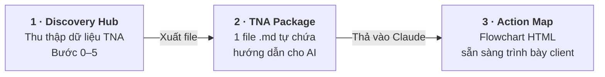

# Discovery Hub — TNA Data Collection Tool

🇬🇧 [Read in English](README.md)

**Công cụ thu thập dữ liệu Training Needs Analysis (TNA) cho Instructional Designers**, xây dựng theo phương pháp Action Mapping (Cathy Moore — *Map It*). Một file HTML duy nhất, chạy offline, không cần cài đặt, không gửi dữ liệu đi đâu.

**▶ Dùng ngay:** https://[username].github.io/discovery-hub/ *(cập nhật link sau khi bật GitHub Pages)*
**▶ Hoặc tải file:** tải `discovery-hub.html` → mở bằng Chrome/Edge

---

## Vì sao có công cụ này?

Làm TNA tử tế cần rất nhiều loại dữ liệu: biên bản chốt goal, dữ liệu vận hành, phỏng vấn nhân viên, phỏng vấn SME, learner profile... Cách truyền thống là hàng chục file rời — điền tay, nhập lại, tổng hợp thủ công. Discovery Hub gom tất cả về một chỗ theo nguyên tắc **nhập một lần — dữ liệu chảy vào mọi tài liệu đầu ra**.

## Tính năng chính

- **Bước 0 — Screening Go/No-Go:** 7 câu sàng lọc xác nhận Action Mapping có phù hợp với dự án không, verdict tự động (GO / GO có điều kiện / NO-GO) kèm khuyến nghị hướng thay thế
- **Bước 1–5 — Thu thập có cấu trúc:** Business Goal → Dữ liệu vận hành (kèm upload file) → Phỏng vấn trực tiếp → Learner Profile → Phỏng vấn SME & Scenario Bank
- **Ghi âm phỏng vấn + transcript tự động** (Chrome/Edge, cần internet) — offline vẫn ghi âm được, dán transcript sau
- **Xuất TNA Package:** một file `.md` duy nhất chứa toàn bộ dữ liệu + hướng dẫn sẵn cho AI — thả vào Claude là tạo được Action Map hoàn chỉnh
- **Song ngữ Việt–Anh**, chuyển đổi tức thì
- **Chạy trên smartphone, tablet, desktop** — tối ưu cho nhập liệu ngay trong lúc phỏng vấn
- **Tự lưu (autosave)** + Export/Import JSON để backup và gộp dữ liệu từ nhiều người thu thập

## Bắt đầu trong 3 phút

1. Mở link (hoặc file) bằng **Chrome/Edge**
2. Làm **Bước 0** — nếu NO-GO, dừng lại và đọc khuyến nghị (nghiêm túc đấy!)
3. Đi lần lượt Bước 1 → 5, nhập đến đâu app tự lưu đến đó
4. **Export JSON** để backup (làm thường xuyên — xem phần Lưu ý)
5. Khi đủ dữ liệu → **Xuất TNA Package** → thả file vào Claude/Cowork → nhận Action Map flowchart

**Chưa có dữ liệu?** Tải file `demo-data.json` trong repo → Import vào app để xem một dự án mẫu hoàn chỉnh.

## Quy trình đầy đủ với AI

| Giai đoạn | Bạn làm gì | Bạn nhận được gì |
|---|---|---|
| **1 · Discovery Hub** | Đi qua Bước 0–5, nhập dữ liệu đến đâu app lưu đến đó | Toàn bộ dữ liệu TNA tập trung một chỗ |
| **2 · TNA Package** | Bấm *Xuất TNA Package* | `TNA_Package_[dự án].md` — mọi câu trả lời, ghi chú, transcript + hướng dẫn phân tích nhúng sẵn |
| **3 · Action Map** | Thả file vào Claude và nói *"Tạo Action Map theo hướng dẫn trong file"* | Flowchart HTML: business goal → phân tích training giải quyết được không → behaviors → practice activities → danh sách bàn giao |

## Yêu cầu & giới hạn — đọc trước khi dùng

| Tính năng | Yêu cầu |
|---|---|
| Nhập liệu, xuất TNA Package, backup | Mọi trình duyệt hiện đại, offline OK |
| Ghi âm phỏng vấn | Chrome/Edge/Safari — bản host HTTPS (mở file trực tiếp có thể bị chặn micro) |
| Transcript tự động | Chỉ Chrome/Edge + có internet |
| Upload file đính kèm | Không dùng chế độ ẩn danh/private (bị chặn IndexedDB) |

## ⚠️ Lưu ý quan trọng về dữ liệu

- **Dữ liệu chỉ nằm trên máy của bạn** (localStorage + IndexedDB của trình duyệt). Không có server, không ai thấy dữ liệu của bạn — kể cả tác giả.
- Điều đó cũng có nghĩa: **xóa lịch sử trình duyệt / dùng chế độ ẩn danh / đổi trình duyệt / đổi máy = mất dữ liệu.** Hãy **Export JSON sau mỗi buổi làm việc.**
- **File JSON export chứa TOÀN BỘ dữ liệu bạn đã nhập** — gồm cả transcript và thông tin client. Kiểm tra NDA trước khi chia sẻ file này cho bất kỳ ai.
- Nếu bạn dùng tính năng AI (nhập API key): key lưu trên máy bạn, **tuyệt đối không chia sẻ file/ảnh chụp màn hình còn dính key.**

## Khắc phục sự cố nhanh

- **"Mất hết dữ liệu!"** → Bạn có đang mở đúng trình duyệt cũ không? Có dùng chế độ ẩn danh không? Import lại file JSON backup gần nhất.
- **Nút ghi âm không hoạt động** → Dùng bản host (link HTTPS) thay vì mở file trực tiếp; kiểm tra quyền micro của trình duyệt.
- **Transcript không chạy** → Chỉ hỗ trợ Chrome/Edge và cần internet. Giải pháp: ghi âm bình thường, dán transcript sau.
- **Mở file thấy toàn code** → File đang được mở bằng trình soạn thảo. Chuột phải → Open with → Chrome.
- **Nhận file qua Zalo không mở được trên iPhone** → Dùng link web thay vì gửi file.

## Đóng góp & phản hồi

Báo lỗi hoặc đề xuất tính năng: [tạo Issue](../../issues) hoặc điền form phản hồi *(thêm link Google Form)*. Khi báo lỗi, vui lòng ghi rõ: trình duyệt + thiết bị + số version (xem footer app).

## Phiên bản

Xem [CHANGELOG.md](CHANGELOG.md). Luôn tải bản mới nhất tại trang này — các bản cũ trôi nổi có thể chứa lỗi đã được sửa.

## Giấy phép & tác giả

Phát hành theo giấy phép **CC BY 4.0** — bạn được tự do sử dụng, chia sẻ và chỉnh sửa, miễn là ghi nguồn.

Thiết kế bởi **Trang Ngo, CPTD** — Instructional Designer & L&D Consultant
Phương pháp: Action Mapping © Cathy Moore (*Map It: The hands-on guide to strategic training design*)

*Nếu công cụ này hữu ích với bạn, một lượt ⭐ star repo hoặc một lời giới thiệu đến đồng nghiệp L&D là sự động viên lớn.*
